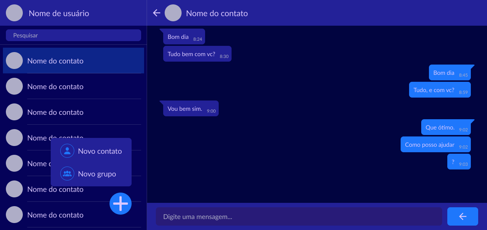
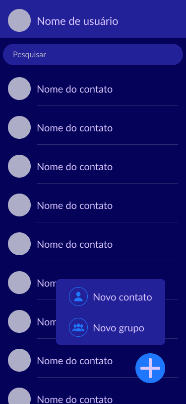

<div id="topo" align="center">

[![Contributors][contributors-shield]][contributors-url]
[![Issues][issues-shield]][issues-url]
[![MIT License][license-shield]][license-url]

</div>

<br>

<div align="center">
  <a href="https://github.com/MBrayanS/lapislazuli-chat">
    
  </a>

  <h3 style="font-size: 32px; font-weight: 500">Lapislazuli Chat</h3>
  <p> Um lugar para conversar e criar novas amizades! </p>

  <h4> 🚧 Em desenvolvimento 🚧 </h4>

</div> 

<br>

<details>
    <summary>Conteúdo</summary>
    <br>
    <ul>
        <li> <a href='#-sobre-o-projeto'>Sobre</a> </li>
        <li> <a href='#-layout'>Layout</a> </li>
        <li> <a href='#-funcionalidades'>Funcionalidades</a> </li>
        <li> <a href='#-documentação'>Documentação</a> </li>
        <li> <a href='#-tecnologias'>Tecnologias</a> </li>
        <li> <a href='#-como-executar-o-projeto'>Como executar</a> </li>
        <li> <a href='#-contribuição'>Contribuição</a> </li>
        <li> <a href='#-colaboradores'>Colaboradores</a> </li>
        <li> <a href='#-autor'>Autor</a> </li>
        <li> <a href='#-licença'>Licença</a> </li>
    </ul>
</details>

## 💻 Sobre o projeto

O `Lapislazuli Chat` é uma aplicação web de bate papo **open source** e sem fins lucrativos. Criado principalmente para por em pratica conhecimentos técnicos e trabalho em equipe. 

Com o objetivo de desenvolver um projeto em grupo que pudesse ser colocado no portfólio. Juntei alguns programadores para trabalhar junto comigo nessa aplicação. E ao final teremos um serviço de bate papo em tempo real.

O código deste repositório está livre para ser clonado e usado por qualquer pessoa. E se você sentir interesse pelo projeto, sinta se avontade para [contruibuir](#-contribuição) conosco. 

<br>

<p align="right"> <a href="#topo">⬆️ Voltar ao topo ⬆️ </a> </p>

***

<br>

## ⚙ Funcionalidades

 Nesta aplicação é possivel **criar uma conta** pessoal e ter **conversas privadas** com outro usuário. Ou **conversar em grupo** com varios usuários ao mesmo tempo.

**Lista de funções** 

 - [ ] Se cadastrar
 - [ ] Fazer login em sua conta
 - [ ] Adicionar outros usuários ao seus contatos
 - [ ] Criar e participar de grupos
 - [ ] Enviar e receber mensagens em tempo real

<br>

<p align="right"> <a href="#topo">⬆️ Voltar ao topo ⬆️ </a> </p>

***

<br>

## 🎨 layout

O design desse projeto foi criado no **Figma**, inspirado em redes sociais como o **WhatsApp**. E você pode acessa-lo através [deste link][figma-design-url].

### Versão desktop

<div align="center">
  
</div>

### Versão mobile

<div align="center">
  
  
</div>

<br>

<p align="right"> <a href="#topo">⬆️ Voltar ao topo ⬆️ </a> </p>

***

<br>

## 📚 Documentação

 Você pode conferir a documentação do backend [neste arquivo](/docs/documentacao.md).

<br>

<p align="right"> <a href="#topo">⬆️ Voltar ao topo ⬆️ </a> </p>

***

<br>

## 🛠 Tecnologias

As seguintes tecnologias foram usadas na construção do projeto:

<br>

**Frontend:** 
- HTML 
- EJS
- CSS
- SASS
- JavaScript

<br>

**Backend:**
- NodeJS
- Express
- Sequelize
- JWT
- Jest
- Socket.io

<br>

<p align="right"> <a href="#topo">⬆️ Voltar ao topo ⬆️ </a> </p>

***

<br>

## 🚀 Como executar o projeto

Para que a aplicação funcione na sua maquina você vai precisar ter instalado o [Git][git-url] e o [NodeJS][node-url].

E após isso basta seguir os comandos:

```bash

# Clone este repositório
$ git clone https://github.com/MBrayanS/lapislazuli-chat.git

# Instale as dependências e execute a aplicação em modo de desenvolvimento com
$ npm install
$ npm run dev

# Ou se você estiver usando yarn
$ yarn 
$ yarn run dev

# E no terminal irá aparecer a porta em que está rodando o projeto.

```

<br>

<p align="right"> <a href="#topo">⬆️ Voltar ao topo ⬆️ </a> </p>

***

<br>

## 🌠 Contribuição

Você deseja contribuir com o projeto e não sabe como?

- Faça um fork do projeto
- Crie uma nova branch para fazer suas alterações
- Salve as modificações e não se esqueça de usar o [padrão de commit][padrao-de-commit-url] do projeto
- E por fim envie as suas alterações através de um pull request

Antes de começar uma nova feature ou uma correção de bug. De uma olhada em [issues][issues-url] para verificar se já não existe alguém trabalhando nisso. 

E caso tenha sobrado alguma dúvida, você pode entrar em contato [comigo](https://github.com/MBrayanS).

<br>

<p align="right"> <a href="#topo">⬆️ Voltar ao topo ⬆️ </a> </p>

***

<br>

## 👨‍💻 Colaboradores

<table>
  <tr>
    <td align="center"> <a href="https://github.com/Hugo-Henrique7">  <br> <b> Hugo-Henrique7 </b> </a> </td>
    <td align="center"> <a href="https://github.com/wesleychiste">  <br> <b> wesleychiste </b> </a> </td>
    <td align="center"> <a href="https://github.com/vicentecarlos">  <br> <b> VicenteCarlos </b> </a> </td>
    <td align="center"> <a href="https://github.com/jaeger-lucas">  <br> <b> Lucas Jaeger </b> </a> </td>
  </tr>
</table>


## 👷 Autor

<table>
  <td align="center">
    <a href="https://github.com/MBrayanS">
      
      <br>
      <b> MBrayanS </b>
    </a>
  </td>
</table>

<br>

<p align="right"> <a href="#topo">⬆️ Voltar ao topo ⬆️ </a> </p>

***

<br>

## 📝 Licença

Este projeto esta sobe a licença [MIT][license-url].

<!-- Links de estilo de referência -->
<!--
    Estou usando "reference style" para deixar o arquivo mais legivel.
    https://www.markdownguide.org/basic-syntax/#reference-style-links
-->

[contributors-url]: https://github.com/MBrayanS/lapislazuli-chat/graphs/contributors
[issues-url]: https://github.com/MBrayanS/lapislazuli-chat/issues
[license-url]: https://github.com/MBrayanS/lapislazuli-chat/blob/main/LICENSE
[figma-design-url]: https://www.figma.com/file/JWdnEMvHKpvcCBL1gNjC5a/lapislazuli-chat?type=design&node-id=402-399&mode=design&t=Q1ppBLZIahbfiUmS-0
[git-url]: https://git-scm.com
[node-url]: https://nodejs.org/en
[padrao-de-commit-url]: https://github.com/MBrayanS/lapislazuli-chat/blob/main/docs/padrao-de-commit.md

[contributors-shield]: https://img.shields.io/github/contributors/MBrayanS/lapislazuli-chat.svg?style=for-the-badge
[issues-shield]: https://img.shields.io/github/issues/MBrayanS/lapislazuli-chat.svg?style=for-the-badge
[license-shield]: https://img.shields.io/github/license/MBrayanS/lapislazuli-chat.svg?style=for-the-badge
